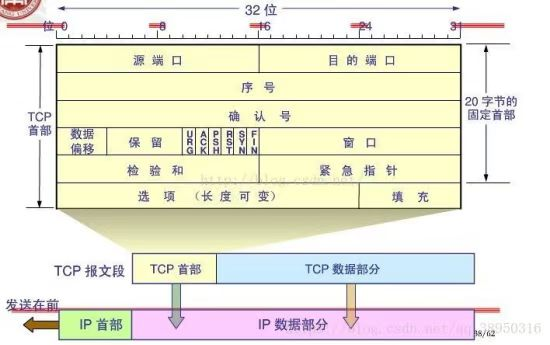
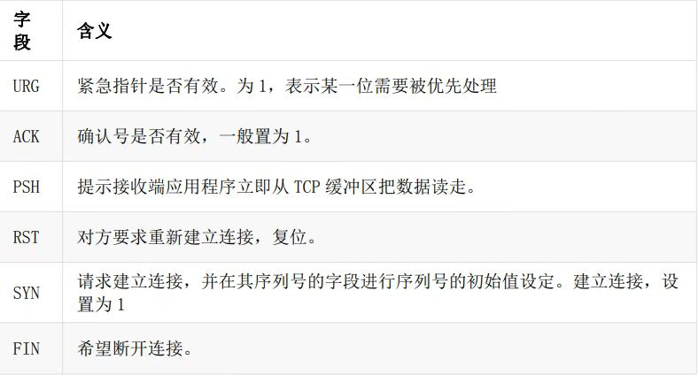
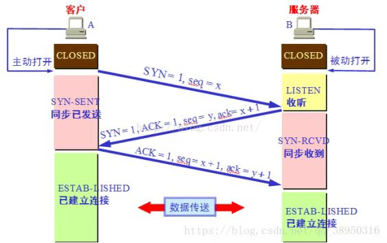
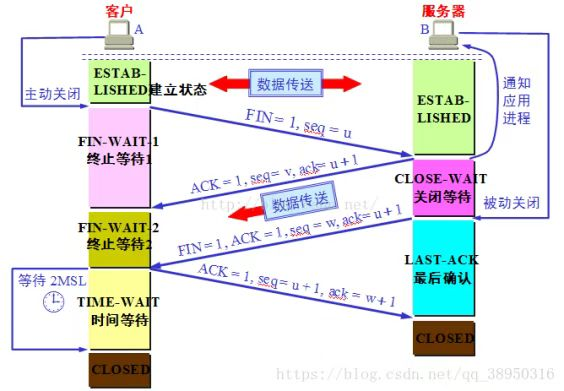
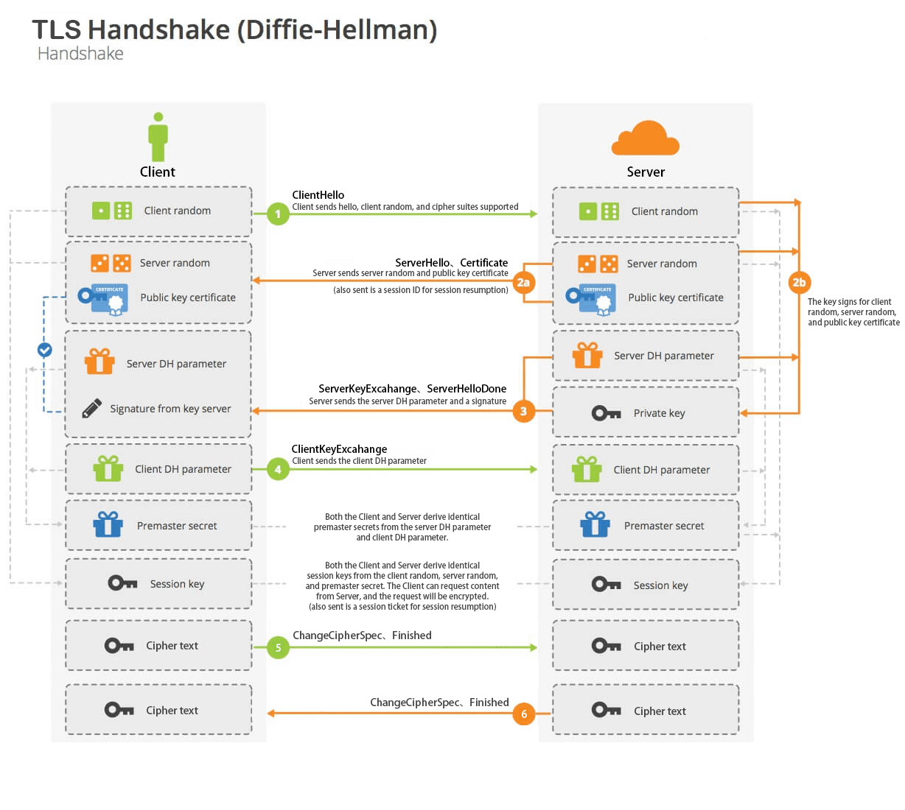

# Computer Basics
## 网络协议

### ip

### tcp/udp

### TLS

#### TLS握手

​		Client 先发送 ClientHello ，在这条消息中，Client 会上报它支持的所有“能力”。client_version 中标识了 Client 能支持的最高 TLS 版本号；random 中标识了 Client 生成的随机数，用于预备主密钥和主密钥以及密钥块的生成，总长度是 32 字节，其中前 4 个字节是时间戳，后 28 个字节是随机数；cipher_suites 标识了 Client 能够支持的密码套件。extensions 中标识了 Client 能够支持的所有扩展。

​		Server 在收到 ClientHello 之后，如果能够继续协商，就会发送 ServerHello，否则发送 Hello Request 重新协商。在 ServerHello 中，Server 会结合 Client 的能力，选择出双方都支持的协议版本以及密码套件进行下一步的握手流程。server_version 中标识了经过协商以后，Server 选出了双方都支持的协议版本。random 中标识了 Server 生成的随机数，用于预备主密钥和主密钥以及密钥块的生成，总长度是 32 字节，其中前 4 个字节是时间戳，后 28 个字节是随机数；cipher_suites 标识了经过协商以后，Server 选出了双方都支持的密码套件。extensions 中标识了 Server 处理 Client 的 extensions 之后的结果。

​		当协商出了双方都能满足的密钥套件，根据需要 Server 会发送 Certificate 消息。Certificate 消息会带上 Server 的证书链。Certificate 消息的目的一是为了验证 Server 身份，二是为了让 Client 根据协商出来的密码套件从证书中获取 Server 的公钥。Client 拿到 Server 的公钥和 server 的 random 会生成预备主密钥。

​		由于密钥协商算法是 RSA，需要 Server 在发送完 Certificate 消息以后就直接发送 ServerHelloDone 消息了。

#### 主密钥交换

​		Client 收到 ServerHelloDone 消息以后，会开始计算预备主密钥，计算出来的预备主密钥会经过 RSA/ECDSA 算法加密，并通过 ClientKeyExchange 消息发送给 Server。RSA 密码套件的预备主密钥是 48 字节。前 2 个字节是 client_version，后 46 字节是随机数。Server 收到 ClientKeyExchange 消息以后就会开始计算主密钥和密钥块了。同时 Client 也会在自己本地算好主密钥和密钥块。

​		Client 发送完 ClientKeyExchange 消息紧接着还会继续发送 ChangeCipherSpec 消息和 Finished 消息。Server 也会回应 ChangeCipherSpec 消息和 Finished 消息。如果 Finished 消息校验完成以后，代表握手最终成功。

#### TLS关闭

​		当页面关闭的时候，Server 会给 Client 发送 TLS Alert 消息，这条消息里面的描述就是 Close Notify。同时 Server 会发送 FIN 包开始 4 次挥手。在 TCP 4 次挥手之前，TLS 层会先收到 Close Notify 的 Alert 消息。

### http

## 设计模式

### 设计模式的类型

#### 创建性模式

​	这些设计模式提供了一种在创建对象的同时隐藏创建逻辑的方式，而不是使用 new 运算符直接实例化对象。这使得程序在判断针对某个给定实例需要创建哪些对象时更加灵活。

- 工厂模式（Factory Pattern）
- 抽象工厂模式（Abstract Factory Pattern）
- 单例模式（Singleton Pattern）
- 建造者模式（Builder Pattern）
- 原型模式（Prototype Pattern）

#### 结构性模式

​	这些设计模式关注类和对象的组合。继承的概念被用来组合接口和定义组合对象获得新功能的方式。

- 适配器模式（Adapter Pattern）
- 桥接模式（Bridge Pattern）
- 过滤器模式（Filter、Criteria Pattern）
- 组合模式（Composite Pattern）
- 装饰器模式（Decorator Pattern）
- 外观模式（Facade Pattern）
- 享元模式（Flyweight Pattern）
- 代理模式（Proxy Pattern）

#### 行为性模式

​	这些设计模式特别关注对象之间的通信。

- 责任链模式（Chain of Responsibility Pattern）
- 命令模式（Command Pattern）
- 解释器模式（Interpreter Pattern）
- 迭代器模式（Iterator Pattern）
- 中介者模式（Mediator Pattern）
- 备忘录模式（Memento Pattern）
- 观察者模式（Observer Pattern）
- 状态模式（State Pattern）
- 空对象模式（Null Object Pattern）
- 策略模式（Strategy Pattern）
- 模板模式（Template Pattern）
- 访问者模式（Visitor Pattern）

#### J2EE模式

​	这些设计模式特别关注表示层。这些模式是由 Sun Java Center 鉴定的。

- 责任链模式（Chain of Responsibility Pattern）
- 命令模式（Command Pattern）
- 解释器模式（Interpreter Pattern）
- 迭代器模式（Iterator Pattern）
- 中介者模式（Mediator Pattern）
- 备忘录模式（Memento Pattern）
- 观察者模式（Observer Pattern）
- 状态模式（State Pattern）
- 空对象模式（Null Object Pattern）
- 策略模式（Strategy Pattern）
- 模板模式（Template Pattern）
- 访问者模式（Visitor Pattern）

### 设计模式的原则

#### 开闭原则（Open Close Principle）

​		开闭原则的意思是：**对扩展开放，对修改关闭**。在程序需要进行拓展的时候，不能去修改原有的代码，实现一个热插拔的效果。简言之，是为了使程序的扩展性好，易于维护和升级。想要达到这样的效果，我们需要使用接口和抽象类，后面的具体设计中我们会提到这点。

#### 里氏代换原则（Liskov Substitution Principle）

​	里氏代换原则是面向对象设计的基本原则之一。 里氏代换原则中说，任何基类可以出现的地方，子类一定可以出现。LSP 是继承复用的基石，只有当派生类可以替换掉基类，且软件单位的功能不受到影响时，基类才能真正被复用，而派生类也能够在基类的基础上增加新的行为。里氏代换原则是对开闭原则的补充。实现开闭原则的关键步骤就是抽象化，而基类与子类的继承关系就是抽象化的具体实现，所以里氏代换原则是对实现抽象化的具体步骤的规范。

#### 依赖倒转原则（Dependence Inversion Principle）

​	这个原则是开闭原则的基础，具体内容：针对接口编程，依赖于抽象而不依赖于具体。

#### 接口隔离原则（Interface Segregation Principle）

​	这个原则的意思是：使用多个隔离的接口，比使用单个接口要好。它还有另外一个意思是：降低类之间的耦合度。由此可见，其实设计模式就是从大型软件架构出发、便于升级和维护的软件设计思想，它强调降低依赖，降低耦合。

#### 迪米特法则，又称最少知道原则（Demeter Principle）

​	最少知道原则是指：一个实体应当尽量少地与其他实体之间发生相互作用，使得系统功能模块相对独立。

#### 合成复用原则（Composite Reuse Principle）

​	合成复用原则是指：尽量使用合成/聚合的方式，而不是使用继承。

## 数据结构
* Queue
* Stack
* Tree
* Array
* List
* Map
* Graph

## 算法

### 排序

- 冒泡排序
- 选择排序
- 插入排序
- 快速排序
- 归并排序
- 堆排序

### 查找

- 二分查找
- 牛顿递归
- 斐波那契额查找

### 动态规划

### 分治

### 贪心