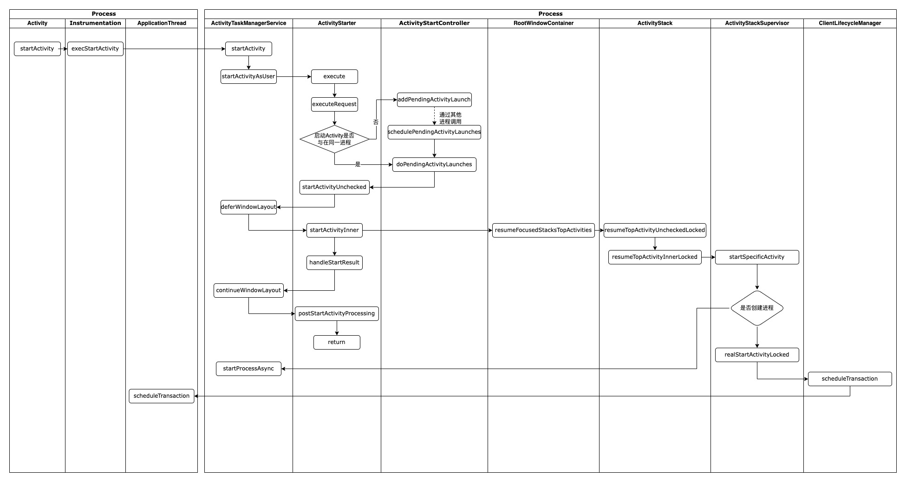
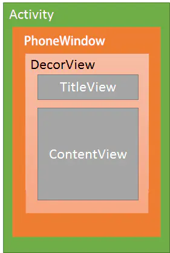

# 安卓
## 应用启动
* Zygote进程或fork的子进程都由脚本启动，init.zygote32_64.rc脚本使用了两个Service类型语句启动了两个Zygote进程
    ```shell
    service zygote /system/bin/app_process32 -Xzygote /system/bin --zygote --start-system-server --socket-name=zygote
    class main
    priority -20
    user root
    group root readproc reserved_disk
    socket zygote stream 660 root system
    onrestart write /sys/android_power/request_state     wake
    onrestart write /sys/power/state on
    onrestart restart audioserver
    onrestart restart cameraserver
    onrestart restart media
    onrestart restart netd
    onrestart restart wificond
    writepid /dev/cpuset/foreground/tasks 
    
    service zygote_secondary /system/bin/app_process64 -Xzygote /system/bin --zygote     --socket-name=zygote_secondary
    class main
    priority -20
    user root
    group root readproc reserved_disk
    socket zygote_secondary stream 660 root system
    onrestart restart zygote
    writepid /dev/cpuset/foreground/tasks
    ```
    
* Zygote进程和由它fork出来的子进程都会进入app_main.cpp的main函数中
    ```java
    int main(int argc, char* const argv[]) {
    ...
    while (i < argc) {
        const char* arg = argv[i++];
        if (strcmp(arg, "--zygote") == 0) {
            zygote = true;
            niceName = ZYGOTE_NICE_NAME;
        } else if (strcmp(arg, "--start-system-server") == 0) {
            startSystemServer = true;
        } else if (strcmp(arg, "--application") == 0) {
            application = true;
        } else if (strncmp(arg, "--nice-name=", 12) == 0) {
            niceName.setTo(arg + 12);
        } else if (strncmp(arg, "--", 2) != 0) {
            className.setTo(arg);
            break;
        } else {
            --i;
            break;
        }
    }
    
    ...
    
    if (zygote) {
        runtime.start("com.android.internal.os.ZygoteInit", args, zygote);
    } else if (className) {
        runtime.start("com.android.internal.os.RuntimeInit", args, zygote);
    } else {
        fprintf(stderr, "Error: no class name or --zygote supplied.\n");
        app_usage();
        LOG_ALWAYS_FATAL("app_process: no class name or --zygote supplied.");
    }
    }
    ```
    
    
* startActivity启动过程
  

* AMS启动应用进程
  

* 应用启动流程
    * ApplicationThread
    * ActivityThread

    

## Activity生命周期

ApplicationThread调用scheduleThranaction,通过TransactionExecutor.execute(ClientTransaction transaction),executeLifecycleState执行后会自动补全中间的生命周期，launch Activity后会发送下个生命周期状态为resume，从onCreate到onResume中间的生命周期会补全

```java
public void execute(ClientTransaction transaction) {
  ……
  executeCallbacks(transaction);
  executeLifecycleState(transaction);
  ……
}
```

## Activity窗口



* Activity初始化过程

  ```java
  public final class ActivityThread extends ClientTransactionHandler implements ActivityThreadInternal {
    	...
  		private Activity performLaunchActivity(ActivityClientRecord r, Intent customIntent) {
        	Activity activity = mInstrumentation.newActivity(cl, component.getClassName(), r.intent);
        	...
          Application app = r.packageInfo.makeApplication(false, mInstrumentation);
        	...
          Window window = r.mPendingRemoveWindow;//ActivityClientRecord r
        	...
          activity.attach(appContext, this, getInstrumentation(), r.token,
                          r.ident, app, r.intent, r.activityInfo, title, r.parent,
                          r.embeddedID, r.lastNonConfigurationInstances, config,
                          r.referrer, r.voiceInteractor, window, r.configCallback,
                          r.assistToken, r.shareableActivityToken);
        	...
          if (r.isPersistable()) {
              mInstrumentation.callActivityOnCreate(activity, r.state, r.persistentState);
          } else {
              mInstrumentation.callActivityOnCreate(activity, r.state);
          }
        	...
        	r.activity = activity;
        	...
          r.setState(ON_CREATE);
        	...
          return activity;
      }
    	...
  }
  ```

* Activity创建Window及setContentView过程

  ```java
  public class Activity extends ContextThemeWrapper implements ... {
          ...
          final void attach(Context context, ActivityThread aThread,...) {
          attachBaseContext(context);
          mWindow = new PhoneWindow(this, window, activityConfigCallback);
  				...
          mWindow.setWindowManager(
                  (WindowManager)context.getSystemService(Context.WINDOW_SERVICE),
                  mToken, mComponent.flattenToString(),
                  (info.flags & ActivityInfo.FLAG_HARDWARE_ACCELERATED) != 0);
          if (mParent != null) {
              mWindow.setContainer(mParent.getWindow());
          }
          mWindowManager = mWindow.getWindowManager();
          ...
      }
      ...
          public void setContentView(@LayoutRes int layoutResID) {
          getWindow().setContentView(layoutResID);
          initWindowDecorActionBar();
      }
  		...
      public void setContentView(View view) {
          getWindow().setContentView(view);
          initWindowDecorActionBar();
      }
  
      public void setContentView(View view, ViewGroup.LayoutParams params) {
          getWindow().setContentView(view, params);
          initWindowDecorActionBar();
      }
  }
  ```

* PhoneWindow的setContentView流程

  ```java
  @Override
  public void setContentView(int layoutResID) {
  
      if (mContentParent == null) {
        	installDecor();//创建DecorView
      } else if (!hasFeature(FEATURE_CONTENT_TRANSITIONS)) {
        	mContentParent.removeAllViews();
      }
  
      if (hasFeature(FEATURE_CONTENT_TRANSITIONS)) {
          final Scene newScene = Scene.getSceneForLayout(mContentParent, layoutResID,
                                                         getContext());
          transitionTo(newScene);
      } else {
        	mLayoutInflater.inflate(layoutResID, mContentParent);
      }
    	...
  }
  
  @Override
  public void setContentView(View view) {
    setContentView(view, new ViewGroup.LayoutParams(MATCH_PARENT, MATCH_PARENT));
  }
  
  @Override
  public void setContentView(View view, ViewGroup.LayoutParams params) {
      if (mContentParent == null) {
        	installDecor();//创建DecorView
      } else if (!hasFeature(FEATURE_CONTENT_TRANSITIONS)) {
        	mContentParent.removeAllViews();
      }
  
      if (hasFeature(FEATURE_CONTENT_TRANSITIONS)) {
          view.setLayoutParams(params);
          final Scene newScene = new Scene(mContentParent, view);
          transitionTo(newScene);
      } else {
        	mContentParent.addView(view, params);
      }
    	...
  }
  ```

* Activity的resume流程

  WindowManager调用addView后会初始化ViewRootImpl

  ```java
  public final class ActivityThread extends ClientTransactionHandler implements ActivityThreadInternal {
  		    @Override
      public void handleResumeActivity(ActivityClientRecord r, boolean finalStateRequest,
              boolean isForward, String reason) {
        	...
          // TODO Push resumeArgs into the activity for consideration
          // skip below steps for double-resume and r.mFinish = true case.
          if (!performResumeActivity(r, finalStateRequest, reason)) {
              return;
          }
        	...
          final Activity a = r.activity;
  				...
          if (r.window == null && !a.mFinished && willBeVisible) {
              r.window = r.activity.getWindow();
              View decor = r.window.getDecorView();
              decor.setVisibility(View.INVISIBLE);
              ViewManager wm = a.getWindowManager();
              WindowManager.LayoutParams l = r.window.getAttributes();
              a.mDecor = decor;
              l.type = WindowManager.LayoutParams.TYPE_BASE_APPLICATION;
              l.softInputMode |= forwardBit;
              if (a.mVisibleFromClient) {
                  if (!a.mWindowAdded) {
                      a.mWindowAdded = true;
                      wm.addView(decor, l);
                  } else {
                      a.onWindowAttributesChanged(l);
                  }
              }
            	...
          } else if (!willBeVisible) {
              ...
              r.hideForNow = true;
          }
        	...
  
          // The window is now visible if it has been added, we are not
          // simply finishing, and we are not starting another activity.
          if (!r.activity.mFinished && willBeVisible && r.activity.mDecor != null && !r.hideForNow) {
            	...
              ViewRootImpl impl = r.window.getDecorView().getImpl();
              WindowManager.LayoutParams l = impl != null
                      ? impl.mWindowAttributes : r.window.getAttributes();
              if ((l.softInputMode
                      & WindowManager.LayoutParams.SOFT_INPUT_IS_FORWARD_NAVIGATION)
                      != forwardBit) {
  
                	...
                  if (r.activity.mVisibleFromClient) {
                      ViewManager wm = a.getWindowManager();
                      View decor = r.window.getDecorView();
                      wm.updateViewLayout(decor, l);
                  }
              }
            	...
              if (r.activity.mVisibleFromClient) {
                  r.activity.makeVisible();
              }
          }
  
          r.nextIdle = mNewActivities;
          mNewActivities = r;
          Looper.myQueue().addIdleHandler(new Idler());
      }
  }
  
  public class Activity extends ContextThemeWrapper implements ... {
      void makeVisible() {
          if (!mWindowAdded) {
              ViewManager wm = getWindowManager();
              wm.addView(mDecor, getWindow().getAttributes());
              mWindowAdded = true;
          }
          mDecor.setVisibility(View.VISIBLE);
      }
  }
  ```

  ViewRootImpl调用setView开始布局,mWindowSession对象是com.android.server.wmSession，addToDisplayAsUser函数会调用WMS的addWindow方法

  performDraw会通过Surface的Canvas遍历绘制

  ```java
  public final class ViewRootImpl implements ... {
  		public void setView(View view, WindowManager.LayoutParams attrs, View panelParentView,
              int userId) {
          synchronized (this) {
              if (mView == null) {
                  mView = view;
                	...
                  // Schedule the first layout -before- adding to the window
                  // manager, to make sure we do the relayout before receiving
                  // any other events from the system.
                  requestLayout();//开始布局及绘制
                	...
                  try {
                    	...
                      //内部会执行WMS的addWindow函数
                      res = mWindowSession.addToDisplayAsUser(mWindow, mWindowAttributes,
                              getHostVisibility(), mDisplay.getDisplayId(), userId,
                              mInsetsController.getRequestedVisibility(), inputChannel, mTempInsets,
                              mTempControls);
                    	...
                  } catch (RemoteException e) {
                    	...
                      throw new RuntimeException("Adding window failed", e);
                  } finally {
                    	...
                  }
                	...
              }
          }
      }
    
      @Override
      public void requestLayout() {
          if (!mHandlingLayoutInLayoutRequest) {
              checkThread();
              mLayoutRequested = true;
              scheduleTraversals();
          }
      }
    
      @UnsupportedAppUsage(maxTargetSdk = Build.VERSION_CODES.R, trackingBug = 170729553)
      void scheduleTraversals() {
          if (!mTraversalScheduled) {
              mTraversalScheduled = true;
              mTraversalBarrier = mHandler.getLooper().getQueue().postSyncBarrier();//发送同步障碍消息
              mChoreographer.postCallback(
                      Choreographer.CALLBACK_TRAVERSAL, mTraversalRunnable, null);
              notifyRendererOfFramePending();
              pokeDrawLockIfNeeded();
          }
      }
  
      void unscheduleTraversals() {
          if (mTraversalScheduled) {
              mTraversalScheduled = false;
              mHandler.getLooper().getQueue().removeSyncBarrier(mTraversalBarrier);//移除同步障碍消息
              mChoreographer.removeCallbacks(
                      Choreographer.CALLBACK_TRAVERSAL, mTraversalRunnable, null);
          }
      }
    
    	
      private void performTraversals() {
          ...
          if (mFirst || windowShouldResize || viewVisibilityChanged || params != null
                  || mForceNextWindowRelayout) {
  						...
              if (!mStopped || wasReportNextDraw) {
                	...
                  if (focusChangedDueToTouchMode || mWidth != host.getMeasuredWidth()
                          || mHeight != host.getMeasuredHeight() || dispatchApplyInsets ||
                          updatedConfiguration) {
                    	...
                      performMeasure(childWidthMeasureSpec, childHeightMeasureSpec);
  										...
                      if (measureAgain) {
                        	...
                          performMeasure(childWidthMeasureSpec, childHeightMeasureSpec);
                      }
                    	...
                  }
              }
          } else {
            	...
          }
  
          final boolean didLayout = layoutRequested && (!mStopped || wasReportNextDraw);
        	...
          if (didLayout) {
              performLayout(lp, mWidth, mHeight);
  						...
          }
        	...
          boolean cancelDraw = mAttachInfo.mTreeObserver.dispatchOnPreDraw() || !isViewVisible;
          if (!cancelDraw) {
            	...
              performDraw();
          } else {
              if (isViewVisible) {
                  // Try again
                  scheduleTraversals();
              } else {
                	...
              }
          }
        	...
      }
  }
  ```

  

## Activity事件

### 接收系统事件


​		Activity调用attach时会向Window设置Callback接收事件，Window的Callback会被DecorView调用，将Event传递到Activity。ViewRootImpl通过InputQueue接收Event，并使用ViewPostImeInputStage调用DecorView的dispatchPointerEvent函数。

```java
final class ViewPreImeInputStage extends InputStage {

    @Override
    protected int onProcess(QueuedInputEvent q) {
        if (q.mEvent instanceof KeyEvent) {
          	return processKeyEvent(q);
        } else {
            final int source = q.mEvent.getSource();
            if ((source & InputDevice.SOURCE_CLASS_POINTER) != 0) {
              	return processPointerEvent(q);
            } else if ((source & InputDevice.SOURCE_CLASS_TRACKBALL) != 0) {
              	return processTrackballEvent(q);
            } else {
              	return processGenericMotionEvent(q);
            }
        }
    }

    private int processPointerEvent(QueuedInputEvent q) {
        final MotionEvent event = (MotionEvent)q.mEvent;
      	...
        boolean handled = mView.dispatchPointerEvent(event);
      	...
        return handled ? FINISH_HANDLED : FORWARD;
    }
}

```

### 事件分发


## 线程通信

### HandlerThread

`HandlerThread`内部使用了`Looper`，同时对Looper加锁防止因异步导致获取Looper为空

```java
@Override
public void run() {
    mTid = Process.myTid();
    Looper.prepare();
    synchronized (this) {
        mLooper = Looper.myLooper();
        notifyAll();
    }
    Process.setThreadPriority(mPriority);
    onLooperPrepared();
    Looper.loop();
    mTid = -1;
}

public Looper getLooper() {
    if (!isAlive()) {
      	return null;
    }

    boolean wasInterrupted = false;

    // If the thread has been started, wait until the looper has been created.
    synchronized (this) {
        while (isAlive() && mLooper == null) {
            try {
              	wait();
            } catch (InterruptedException e) {
              	wasInterrupted = true;
            }
        }
    }

  	/*
     * We may need to restore the thread's interrupted flag, because it may
     * have been cleared above since we eat InterruptedExceptions
     */
    if (wasInterrupted) {
      	Thread.currentThread().interrupt();
    }

    return mLooper;
}	
```


### Looper

```java
public final class Looper {
  	...
    static final ThreadLocal<Looper> sThreadLocal = new ThreadLocal<Looper>();
  	...
  	private Looper(boolean quitAllowed) {
        mQueue = new MessageQueue(quitAllowed);
        mThread = Thread.currentThread();
    }
		...
    public static void prepare() {
        prepare(true);
    }
		...
    private static void prepare(boolean quitAllowed) {
        if (sThreadLocal.get() != null) {
            throw new RuntimeException("Only one Looper may be created per thread");
        }
        sThreadLocal.set(new Looper(quitAllowed));
    }
  	...
    public static void loop() {
        final Looper me = myLooper();
        ...
        for (;;) {
            if (!loopOnce(me, ident, thresholdOverride)) {
                return;
            }
        }
    }
  	...
    private static boolean loopOnce(final Looper me,
            final long ident, final int thresholdOverride) {
        Message msg = me.mQueue.next(); // might block
        if (msg == null) {
            // No message indicates that the message queue is quitting.
            return false;
        }
      	...
        try {
            msg.target.dispatchMessage(msg);
          	...
        } catch (Exception exception) {
						...
            throw exception;
        } finally {
            ...
        }
      	...
        msg.recycleUnchecked();
        return true;
    }
}

public class ThreadLocal<T> {
  	...
    public void set(T value) {
        Thread t = Thread.currentThread();
        ThreadLocalMap map = getMap(t);
        if (map != null)
            map.set(this, value);
        else
            createMap(t, value);
    }
  	...
}
```

`Looper`被`sThreadLocal`保持在`Thread`的变量`ThreadLocalMap`中，key为`sThreadLocal`，`sThreadLocal`为全局静态变量，所以每个`Thread`只能存放一个`Looper`

### Handler

```java
public Handler(@NonNull Looper looper, @Nullable Callback callback, boolean async) {
    mLooper = looper;
    mQueue = looper.mQueue;
    mCallback = callback;
    mAsynchronous = async;
}
```

async – If true, the handler calls Message.setAsynchronous(boolean) for each

```java
private boolean enqueueMessage(@NonNull MessageQueue queue, @NonNull Message msg,
long uptimeMillis) {
    msg.target = this;
    msg.workSourceUid = ThreadLocalWorkSource.getUid();

    if (mAsynchronous) {
    msg.setAsynchronous(true);
    }
    return queue.enqueueMessage(msg, uptimeMillis);
}
```

### MessageQueue

```java
public final class MessageQueue {
  	...
		private native static long nativeInit();
    private native static void nativeDestroy(long ptr);
    @UnsupportedAppUsage
    private native void nativePollOnce(long ptr, int timeoutMillis); /*non-static for callbacks*/
    private native static void nativeWake(long ptr);
    private native static boolean nativeIsPolling(long ptr);
    private native static void nativeSetFileDescriptorEvents(long ptr, int fd, int events);

    MessageQueue(boolean quitAllowed) {
        mQuitAllowed = quitAllowed;//主线程禁止用户调用quit
        mPtr = nativeInit();
    }
  	...
    boolean enqueueMessage(Message msg, long when) {
				...
        synchronized (this) {
          	...
            msg.markInUse();
            msg.when = when;
            Message p = mMessages;
            boolean needWake;
            if (p == null || when == 0 || when < p.when) {
                // New head, wake up the event queue if blocked.
                msg.next = p;
                mMessages = msg;
                needWake = mBlocked;
            } else {
                // Inserted within the middle of the queue.  Usually we don't have to wake
                // up the event queue unless there is a barrier at the head of the queue
                // and the message is the earliest asynchronous message in the queue.
                needWake = mBlocked && p.target == null && msg.isAsynchronous();
                Message prev;
                for (;;) {
                    prev = p;
                    p = p.next;
                    if (p == null || when < p.when) {
                        break;
                    }
                    if (needWake && p.isAsynchronous()) {
                        needWake = false;
                    }
                }
                msg.next = p; // invariant: p == prev.next
                prev.next = msg;
            }

            // We can assume mPtr != 0 because mQuitting is false.
            if (needWake) {
                nativeWake(mPtr);
            }
        }
        return true;
    }
  	...
    Message next() {
        // Return here if the message loop has already quit and been disposed.
        // This can happen if the application tries to restart a looper after quit
        // which is not supported.
        final long ptr = mPtr;
        if (ptr == 0) {
            return null;
        }

        int pendingIdleHandlerCount = -1; // -1 only during first iteration
        int nextPollTimeoutMillis = 0;
        for (;;) {
            if (nextPollTimeoutMillis != 0) {
                Binder.flushPendingCommands();
            }

            nativePollOnce(ptr, nextPollTimeoutMillis);

            synchronized (this) {
                // Try to retrieve the next message.  Return if found.
                final long now = SystemClock.uptimeMillis();
                Message prevMsg = null;
                Message msg = mMessages;
                if (msg != null && msg.target == null) {
                    // Stalled by a barrier.  Find the next asynchronous message in the queue.
                    do {
                        prevMsg = msg;
                        msg = msg.next;
                    } while (msg != null && !msg.isAsynchronous());
                }
                if (msg != null) {
                    if (now < msg.when) {
                        // Next message is not ready.  Set a timeout to wake up when it is ready.
                        nextPollTimeoutMillis = (int) Math.min(msg.when - now, Integer.MAX_VALUE);
                    } else {
                        // Got a message.
                        mBlocked = false;
                        if (prevMsg != null) {
                            prevMsg.next = msg.next;
                        } else {
                            mMessages = msg.next;
                        }
                        msg.next = null;
                        if (DEBUG) Log.v(TAG, "Returning message: " + msg);
                        msg.markInUse();
                        return msg;
                    }
                } else {
                    // No more messages.
                    nextPollTimeoutMillis = -1;
                }

                // Process the quit message now that all pending messages have been handled.
                if (mQuitting) {
                    dispose();
                    return null;
                }

                // If first time idle, then get the number of idlers to run.
                // Idle handles only run if the queue is empty or if the first message
                // in the queue (possibly a barrier) is due to be handled in the future.
                if (pendingIdleHandlerCount < 0
                        && (mMessages == null || now < mMessages.when)) {
                    pendingIdleHandlerCount = mIdleHandlers.size();
                }
                if (pendingIdleHandlerCount <= 0) {
                    // No idle handlers to run.  Loop and wait some more.
                    mBlocked = true;
                    continue;
                }

                if (mPendingIdleHandlers == null) {
                    mPendingIdleHandlers = new IdleHandler[Math.max(pendingIdleHandlerCount, 4)];
                }
                mPendingIdleHandlers = mIdleHandlers.toArray(mPendingIdleHandlers);
            }

            // Run the idle handlers.
            // We only ever reach this code block during the first iteration.
            for (int i = 0; i < pendingIdleHandlerCount; i++) {
                final IdleHandler idler = mPendingIdleHandlers[i];
                mPendingIdleHandlers[i] = null; // release the reference to the handler

                boolean keep = false;
                try {
                    keep = idler.queueIdle();
                } catch (Throwable t) {
                    Log.wtf(TAG, "IdleHandler threw exception", t);
                }

                if (!keep) {
                    synchronized (this) {
                        mIdleHandlers.remove(idler);
                    }
                }
            }

            // Reset the idle handler count to 0 so we do not run them again.
            pendingIdleHandlerCount = 0;

            // While calling an idle handler, a new message could have been delivered
            // so go back and look again for a pending message without waiting.
            nextPollTimeoutMillis = 0;
        }
    }
  	...
    void quit(boolean safe) {
        if (!mQuitAllowed) {
            throw new IllegalStateException("Main thread not allowed to quit.");
        }

        synchronized (this) {
            if (mQuitting) {
                return;
            }
            mQuitting = true;

            if (safe) {
                removeAllFutureMessagesLocked();
            } else {
                removeAllMessagesLocked();
            }

            // We can assume mPtr != 0 because mQuitting was previously false.
            nativeWake(mPtr);
        }
    }
  	...
}
```

### 同步屏障

​		Handler发送的消息分为普通消息、屏障消息、异步消息，一旦Looper在处理消息时遇到屏障消息，那么就不再处理普通的消息，而仅仅处理异步的消息。不再使用屏障后，需要撤销屏障，不然就再也执行不到普通消息了。

​		为什么需要这样？它是设计来为了让某些特殊的消息得以更快被执行的机制。比如绘制界面，这种消息可能会明显的被用户感知到，稍有不慎就会引起卡顿、掉帧之类的，所以需要及时处理（可能消息队列中有大量的消息，如果像平时一样挨个进行处理，那绘制界面这个消息就得等很久，这是不想看到的）。

​		屏障消息仅仅是起一个屏障的作用，本身一般不附带其他东西，它需要配合其他Handler组件才能发挥作用。

​		View绘制的起点是ViewRootImpl的requestLayout()开始的。这个方法会去执行三大绘制任务：onMeasure、onLayout、onDraw。调用requestLayout()方法之后，并不会马上开始进行绘制任务，而是会给主线程设置一个同步屏幕，并设置Vsync信号监听。当Vsync信号的到来，会发送一个异步消息到主线程Handler，执行我们上一步设置的绘制监听任务，并移除同步屏障。

## 进程通信

### 共享内存

### AIDL

- aidl结构
- 线程调用

### Socket

## APK编译流程


## 应用设计
* MVVM
* MVP
* MVC
* 模块分层
* 模块隔离
* 模块通信

## NDK
### NDK编译
* ndk-build
* cmake
* autocanf
* make
* ndk集成到自己的构建系统
* JNI
  
### NDK API
* GLES
* OpenSL
* OpenMax
* ……
  
### NDK调试
* Sampleperf
* ndk-stack
* adb logcat
* trace
  
## 动态加载

### ClassLoader

- loadClass

  ```java
  protected Class<?> loadClass(String name, boolean resolve)
          throws ClassNotFoundException {
      // First, check if the class has already been loaded
      Class<?> c = findLoadedClass(name);
      if (c == null) {
          try {
              if (parent != null) {
                  c = parent.loadClass(name, false);
              } else {
                  c = findBootstrapClassOrNull(name);
              }
          } catch (ClassNotFoundException e) {
              // ClassNotFoundException thrown if class not found
              // from the non-null parent class loader
          }
  
          if (c == null) {
              // If still not found, then invoke findClass in order
              // to find the class.
              c = findClass(name);
          }
      }
      return c;
  }
  ```

- findLoadedClass

  ```java
  protected final Class<?> findLoadedClass(String name) {
      ClassLoader loader;
      if (this == BootClassLoader.getInstance())
          loader = null;
      else
          loader = this;
      return VMClassLoader.findLoadedClass(loader, name);
  }
  ```

### BootClassLoader

```java
class BootClassLoader extends ClassLoader
```

- system classloader

  ```java
  private static ClassLoader createSystemClassLoader() {
      String classPath = System.getProperty("java.class.path", ".");
      String librarySearchPath = System.getProperty("java.library.path", "");
      ……
      return new PathClassLoader(classPath, librarySearchPath, BootClassLoader.getInstance());
  }
  ```

- loadClass	

  ```java
  @Override
  protected Class<?> loadClass(String className, boolean resolve)
    throws ClassNotFoundException {
      Class<?> clazz = findLoadedClass(className);
      if (clazz == null) {
          clazz = findClass(className);
      }
      return clazz;
  }
  ```

- findClass

  ```java
  @Override
  protected Class<?> findClass(String name) throws ClassNotFoundException {
      return Class.classForName(name, false, null);
  }
  ```

### BaseDexClassLoader

```java
public class BaseDexClassLoader extends ClassLoader
```

```java
public BaseDexClassLoader(String dexPath,
                          String librarySearchPath, ClassLoader parent, ClassLoader[] sharedLibraryLoaders,
                          ClassLoader[] sharedLibraryLoadersAfter,
                          boolean isTrusted) {
    super(parent);
    // Setup shared libraries before creating the path list. ART relies on the class loader
    // hierarchy being finalized before loading dex files.
    this.sharedLibraryLoaders = sharedLibraryLoaders == null
      ? null
      : Arrays.copyOf(sharedLibraryLoaders, sharedLibraryLoaders.length);
    this.pathList = new DexPathList(this, dexPath, librarySearchPath, null, isTrusted);
    this.sharedLibraryLoadersAfter = sharedLibraryLoadersAfter == null
      ? null
      : Arrays.copyOf(sharedLibraryLoadersAfter, sharedLibraryLoadersAfter.length);
    // Run background verification after having set 'pathList'.
    this.pathList.maybeRunBackgroundVerification(this);
    reportClassLoaderChain();
}
```

- findClass

  ```java
  @Override
  protected Class<?> findClass(String name) throws ClassNotFoundException {
      // First, check whether the class is present in our shared libraries.
      if (sharedLibraryLoaders != null) {
          for (ClassLoader loader : sharedLibraryLoaders) {
              try {
                  return loader.loadClass(name);
              } catch (ClassNotFoundException ignored) {
              }
          }
      }
      // Check whether the class in question is present in the dexPath that
      // this classloader operates on.
      List<Throwable> suppressedExceptions = new ArrayList<Throwable>();
      Class c = pathList.findClass(name, suppressedExceptions);
      if (c != null) {
          return c;
      }
      // Now, check whether the class is present in the "after" shared libraries.
      if (sharedLibraryLoadersAfter != null) {
          for (ClassLoader loader : sharedLibraryLoadersAfter) {
              try {
                  return loader.loadClass(name);
              } catch (ClassNotFoundException ignored) {
              }
          }
      }
      if (c == null) {
          ClassNotFoundException cnfe = new ClassNotFoundException(
                  "Didn't find class \"" + name + "\" on path: " + pathList);
          for (Throwable t : suppressedExceptions) {
              cnfe.addSuppressed(t);
          }
          throw cnfe;
      }
      return c;
  }
  ```

### DexPathList

```java
DexPathList(ClassLoader definingContext, String dexPath,
            String librarySearchPath, File optimizedDirectory, boolean isTrusted) {
    if (definingContext == null) {
        throw new NullPointerException("definingContext == null");
    }
    if (dexPath == null) {
        throw new NullPointerException("dexPath == null");
    }
    if (optimizedDirectory != null) {
        if (!optimizedDirectory.exists()) {
            throw new IllegalArgumentException(
                    "optimizedDirectory doesn't exist: "
                            + optimizedDirectory);
        }
        if (!(optimizedDirectory.canRead()
                && optimizedDirectory.canWrite())) {
            throw new IllegalArgumentException(
                    "optimizedDirectory not readable/writable: "
                            + optimizedDirectory);
        }
    }
    this.definingContext = definingContext;
    ArrayList<IOException> suppressedExceptions = new ArrayList<IOException>();
    // save dexPath for BaseDexClassLoader
    this.dexElements = makeDexElements(splitDexPath(dexPath), optimizedDirectory,
            suppressedExceptions, definingContext, isTrusted);
    // Native libraries may exist in both the system and
    // application library paths, and we use this search order:
    //
    //   1. This class loader's library path for application libraries (librarySearchPath):
    //   1.1. Native library directories
    //   1.2. Path to libraries in apk-files
    //   2. The VM's library path from the system property for system libraries
    //      also known as java.library.path
    //
    // This order was reversed prior to Gingerbread; see http://b/2933456.
    this.nativeLibraryDirectories = splitPaths(librarySearchPath, false);
    this.systemNativeLibraryDirectories =
            splitPaths(System.getProperty("java.library.path"), true);
    this.nativeLibraryPathElements = makePathElements(getAllNativeLibraryDirectories());
    if (suppressedExceptions.size() > 0) {
        this.dexElementsSuppressedExceptions =
                suppressedExceptions.toArray(new IOException[suppressedExceptions.size()]);
    } else {
        dexElementsSuppressedExceptions = null;
    }
}
```

- findClass

  ```java
  public Class<?> findClass(String name, List<Throwable> suppressed) {
      for (Element element : dexElements) {
          Class<?> clazz = element.findClass(name, definingContext, suppressed);
          if (clazz != null) {
              return clazz;
          }
      }
      if (dexElementsSuppressedExceptions != null) {
          suppressed.addAll(Arrays.asList(dexElementsSuppressedExceptions));
      }
      return null;
  }
  ```

### 热修复

### 插件化

## 优化

### 性能分析

### 编译速度优化

### 缩减应用体积

### 内存优化
* 内存泄漏问题（显示引用、隐示引用（内部类、匿名内部类））
  
### 电量优化
### 问题排查
* ANR
* java crash
* native carsh
* 卡顿
  
### 调试
* Trace

## 第三方库及框架
### retrofit

### glide

### okhttp

## 安卓特有数据结构

### SparseArray
* int[] mKeys、Object[] mValues双数组数据结构
* 通过二分查找确定index位置
* 删除使用Delete标记字段
* put位置为Delete则覆盖，否则后移元素后插入value
* 如数组已满则创建新数组扩容，拷贝数据后再执行移动元素插入value操作,新数组长度size*2
* gc有Delete标记的数据，元素前移
  
### ArrayMap
* int[] mHashes、Object[] mArray双数组数据结构
* mArray长度为mHashes的2倍
* mArray[index<<1]存储Key，mArray[index<<1+1]存储Value
* put操作覆盖原值，如index位置key不一致则后移元素后插入Value，mHashes后移一位，mArray后移两位
* 如数组已满则进行扩容调用allocArrays(n)，然后调用freeArrays释放原数组，扩容数组长度为8、4分别使用缓存数组
* 扩容的旧数组先对所有Value元素置空，然后存放缓存数组
  
## androidx
* ViewModel、AndroidViewModel
* LiveData
* Hilt、Dagger
* LifeCycle
