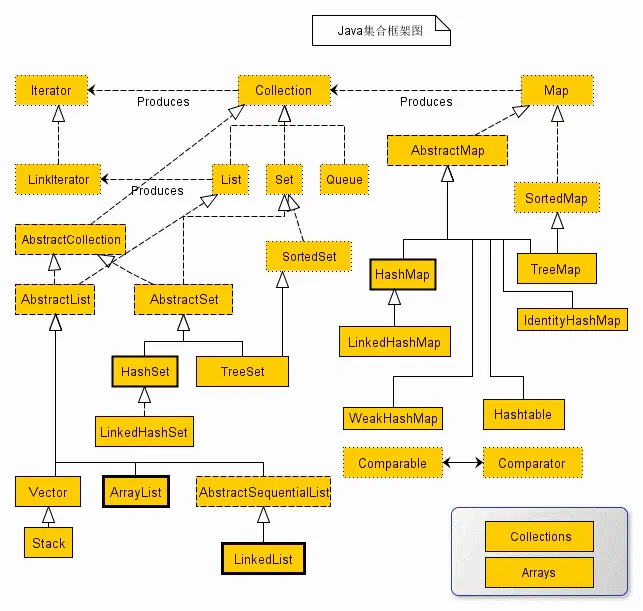

# Java Develop

## JVM

## 内存管理

## 多线程与线程锁
1. 线程

2. 线程锁

   	

   - CAS原理

   - AQS原理

     ​	CAS （compareAndSwap），中文叫比较交换，是一种无锁原子算法。映射到操作系统就是一条CPU的原子指令，其作用是让CPU先进行比较两个值是否相等，然后原子地更新某个位置的值，其实现方式是基于硬件平台的汇编指令，在intel的CPU中，使用的是cmpxchg指令，就是说CAS是靠硬件实现的，从而在硬件层面提升效率。

     ​	执行过程是这样： CAS（V，E，N），V表示要更新变量的值，E表示预期值，N表示新值。仅当 V值等于E值时，才会将V的值设为N，如果V值和E值不同，则说明已经有其他线程完成更新，则当前线程则什么都不做，最后CAS 返回当前V的真实值。

     ​	Unsafe是CAS的核心类，Java无法直接访问底层操作系统，而是通过本地（native）方法来访问。不过尽管如此，JVM还是开了一个后门：Unsafe，它提供了硬件级别的原子操作。AtomicInteger内部使用了Unsafe。

     ​	与锁相比，使用CAS会使程序看起来更加复杂一些，但是使用无锁的方式完全没有锁竞争带来的线程间频繁调度的开销和阻塞，它对死锁问题天生免疫，因此他要比基于锁的方式拥有更优越的性能。

     ​	CAS虽然高效地解决了原子操作，但是还是存在一些缺陷的：

     ​		1.自旋时间太长

     ​		2.只能保证一个共享变量原子操作

     ​		3.ABA问题

   - CountDownLatch、CyclicBarrier、Semaphore

     - CountDownLatch

       有一个任务A，它要等待其他4个任务执行完毕之后才能执行，此时就可以利用CountDownLatch来实现这种功能了。

       ```java
       class Driver { // ...
           void main() throws InterruptedException {
               CountDownLatch startSignal = new CountDownLatch(1);
               CountDownLatch doneSignal = new CountDownLatch(N);
       
               for (int i = 0; i < N; ++i) // create and start threads
                   new Thread(new Worker(startSignal, doneSignal)).start();
       
               doSomethingElse();            // don't let run yet
               startSignal.countDown();      // let all threads proceed
               doSomethingElse();
               doneSignal.await();           // wait for all to finish
           }
       }
       
       class Worker implements Runnable {
           private final CountDownLatch startSignal;
           private final CountDownLatch doneSignal;
       
           Worker(CountDownLatch startSignal, CountDownLatch doneSignal) {
               this.startSignal = startSignal;
               this.doneSignal = doneSignal;
           }
       
           public void run() {
               try {
                   startSignal.await();
                   doWork();
                   doneSignal.countDown();
               } catch (InterruptedException ex) {
               } // return;
           }
       
           void doWork() { ...}
       }
       ```

     - CyclicBarrier

       ```java
       class Solver {
           final int N;
           final float[][] data;
           final CyclicBarrier barrier;
       
           class Worker implements Runnable {
               int myRow;
       
               Worker(int row) {
                   myRow = row;
               }
       
               public void run() {
                   while (!done()) {
                       processRow(myRow);
       
                       try {
                           barrier.await();
                       } catch (InterruptedException ex) {
                           return;
                       } catch (BrokenBarrierException ex) {
                           return;
                       }
                   }
               }
           }
       
           public Solver(float[][] matrix) {
               data = matrix;
               N = matrix.length;
               Runnable barrierAction =
                       new Runnable() {
                           public void run() {
                               mergeRows(...);
                           }
                       };
               barrier = new CyclicBarrier(N, barrierAction);
       
               List<Thread> threads = new ArrayList<>(N);
               for (int i = 0; i < N; i++) {
                   Thread thread = new Thread(new Worker(i));
                   threads.add(thread);
                   thread.start();
               }
       
               // wait until done
               for (Thread thread : threads)
                   thread.join();
           }
       }
       ```

       await()用来挂起当前线程，直至所有线程都到达barrier状态再同时执行后续任务,barrierAction为当这些线程都达到barrier状态时会执行的内容。CyclicBarrier运行完后可以重用。

     - Semaphore

       ```java
       
       class Pool {
           private static final int MAX_AVAILABLE = 100;
           private final Semaphore available = new Semaphore(MAX_AVAILABLE, true);
       
           public Object getItem() throws InterruptedException {
               available.acquire();
               return getNextAvailableItem();
           }
       
           public void putItem(Object x) {
               if (markAsUnused(x))
                   available.release();
           }
       
           // Not a particularly efficient data structure; just for demo
       
           protected Object[] items = ...
           whatever kinds
           of items
           being managed
           protected boolean[] used = new boolean[MAX_AVAILABLE];
       
           protected synchronized Object getNextAvailableItem() {
               for (int i = 0; i < MAX_AVAILABLE; ++i) {
                   if (!used[i]) {
                       used[i] = true;
                       return items[i];
                   }
               }
               return null; // not reached
           }
       
           protected synchronized boolean markAsUnused(Object item) {
               for (int i = 0; i < MAX_AVAILABLE; ++i) {
                   if (item == items[i]) {
                       if (used[i]) {
                           used[i] = false;
                           return true;
                       } else
                           return false;
                   }
               }
               return false;
           }
       }
       ```

       

   - synchronized原理

     - Java对象头

       - Mark Word

         

       - Klass Point（指向类的指针）

         该指针在32位JVM中的长度是32bit，在64位JVM中长度是64bit。

         Java对象的类数据保存在方法区。

       - 数组长度（只有数组对象才有）

         只有数组对象保存了这部分数据。

         该数据在32位和64位JVM中长度都是32bit。

     - Monitor

       Monitor可以理解为一个同步工具或一种同步机制，通常被描述为一个对象。每一个Java对象就有一把看不见的锁，称为内部锁或者Monitor锁。

       Monitor是线程私有的数据结构，每一个线程都有一个可用monitor record列表，同时还有一个全局的可用列表。每一个被锁住的对象都会和一个monitor关联，同时monitor中有一个Owner字段存放拥有该锁的线程的唯一标识，表示该锁被这个线程占用。

       现在话题回到synchronized，synchronized通过Monitor来实现线程同步，Monitor是依赖于底层的操作系统的Mutex Lock（互斥锁）来实现的线程同步。

   * 无锁、偏向锁、轻量级锁、重量级锁

   * 乐观锁、悲观锁

     * 悲观锁

       ​	悲观锁认为自己在使用数据的时候一定有别的线程来修改数据，因此在获取数据的时候会先加锁，确保数据不会被别的线程修改。

       ​	synchronized关键字和Lock的实现类都是悲观锁。

     * 乐观锁

       ​	乐观锁认为自己在使用数据时不会有别的线程修改数据，所以不会添加锁，只是在更新数据的时候去判断之前有没有别的线程更新了这个数据。如果这个数据没有被更新，当前线程将自己修改的数据成功写入。如果数据已经被其他线程更新，则根据不同的实现方式执行不同的操作（例如报错或者自动重试）。

       ​	乐观锁在Java中是通过使用无锁编程来实现，最常采用的是CAS算法，Java原子类中的递增操作就通过CAS(Compare And Swap)自旋实现的。

   * 自旋锁、适应性自旋锁

     * 自旋锁

       ​	自旋锁的原理是使用CAS，不挂起线程，痛殴循环实现自旋操作，AtomicInteger中调用unsafe进行自增操作的源码中的do-while循环就是一个自旋操作，如果修改数值失败则通过循环来执行自旋，直至修改成功。

       ```java
       public final int getAndAddInt(Object o, long offset, int delta) {
       	int v;
         do {
         v = this.getIntVolatile(o, offset);
         } while(!this.weakCompareAndSetInt(o, offset, v, v + delta));
       
         return v;
       }
       ```

       

       

     * 适应性自旋锁

       ​	自旋锁本身是有缺点的，它不能代替阻塞。自旋等待虽然避免了线程切换的开销，但它要占用处理器时间。如果锁被占用的时间很短，自旋等待的效果就会非常好。反之，如果锁被占用的时间很长，那么自旋的线程只会白浪费处理器资源。所以，自旋等待的时间必须要有一定的限度，如果自旋超过了限定次数（默认是10次，可以使用-XX:PreBlockSpin来更改Java虚拟机设置适应性自旋锁开关）没有成功获得锁，就应当挂起线程。

   * 公平锁、非公平锁

     ​	ReentrantLock在构造方法里实现了FairSync与NonFairSync,default is NonFarSync

     ​	synchronized为非公平锁，当一个线程想获取锁时，先试图插队，如果占用锁的线程释放了锁，下一个线程还没来得及拿锁，那么当前线程就可以直接获得锁；如果锁正在被其它线程占用，则排队，排队的时候就不能再试图获得锁了，只能等到前面所有线程都执行完才能获得锁。

     ​	非公平锁的优点是可以减少唤起线程的开销，整体的吞吐效率高，因为线程有几率不阻塞直接获得锁，CPU不必唤醒所有线程。缺点是处于等待队列中的线程可能会饿死，或者等很久才会获得锁。

   - 可重入锁、非可重入锁

     - 可重入锁(ReentrantLock\synchronized)

       ​	可重入锁又名递归锁，是指在同一个线程在外层方法获取锁的时候，再进入该线程的内层方法会自动获取锁（前提锁对象得是同一个对象或者class），不会因为之前已经获取过还没释放而阻塞。Java中ReentrantLock和synchronized都是可重入锁，可重入锁的一个优点是可一定程度避免死锁。

     - 非可重入锁(NonReentrantLock)

       ​	首先ReentrantLock和NonReentrantLock都继承父类AQS，其父类AQS中维护了一个同步状态status来计数重入次数，status初始值为0。	

       ​	可重入锁先尝试获取并更新status值，如果status == 0表示没有其他线程在执行同步代码，则把status置为1，当前线程开始执行。如果status != 0，则判断当前线程是否是获取到这个锁的线程，如果是的话执行status+1，且当前线程可以再次获取锁。而非可重入锁是直接去获取并尝试更新当前status的值，如果status != 0的话会导致其获取锁失败，当前线程阻塞。

   - 独享锁、共享锁

   

## 泛型<>
* super对应kotlin中的关键字in
* extend对应kotlin中的关键字out
* ?的使用
* 能否将固定格式强转位泛型格式

## 序列化
* Serializable
* Externalizable
* Parcelable

## JNI
* 内存管理
* 静态注册、动态注册

## java中的数据结构


### HashMap
* 初始化加载因子loadFactor（默认0.75f）
* 初始容量initialCapacity，通过无符号右移计算出大于且最接近initialCapacity的threshold临界值为``$2^n$``
```
static final int tableSizeFor(int cap) {
    int n = cap - 1;
    n |= n >>> 1;
    n |= n >>> 2;
    n |= n >>> 4;
    n |= n >>> 8;
    n |= n >>> 16;
    return (n < 0) ? 1 : (n >= MAXIMUM_CAPACITY) ? MAXIMUM_CAPACITY : n + 1;
}
```
* hash计算，hashcode前16位与后16位进行异或位运算
```
static final int hash(Object key) {
    int h;
    return (key == null) ? 0 : (h = key.hashCode()) ^ (h >>> 16);
}
```
* HashMap内的数据存储在table数组中，table的元素为Node链表结构，当Node链表长度>=8时转换为红黑树，同时Node转换为TreeNode
* put操作
    * table为空则resize进行扩容
    ```
    Node<K,V>[] tab; Node<K,V> p; int n, i;
    if ((tab = table) == null || (n = tab.length) == 0)
        n = (tab = resize()).length;
    ```
    * 计算key对应在table中的index位置，若当前index无数据则直接赋值新Node
    ```
    if ((p = tab[i = (n - 1) & hash]) == null)
        tab[i] = newNode(hash, key, value, null);
    ```
    * 若当前index存在数据
        * 若当前Node的Key是否与插入Key一致，则插入Value
        ```
        Node<K,V> e; K k;
        if (p.hash == hash &&
            ((k = p.key) == key || (key != null && key.equals(k))))
            e = p;
        ```
        * 若当前Node为TreeNode则插入红黑树
        ```
        else if (p instanceof TreeNode)
            e = ((TreeNode<K,V>)p).putTreeVal(this, tab, hash, key, value);
        ```
        * 否则插入到链表Node中
            * 若在Node链表中查找到插入Key则插入Value
            * 否则创建直接在Node链表的末尾插入新Node，插入后若链表长度是否达到临界值8，则将链表转换为红黑树
        ```
        for (int binCount = 0; ; ++binCount) {
            if ((e = p.next) == null) {
                p.next = newNode(hash, key, value, null);
                if (binCount >= TREEIFY_THRESHOLD - 1) // -1 for 1st
                    treeifyBin(tab, hash);
                break;
            }
            if (e.hash == hash &&
                ((k = e.key) == key || (key != null && key.equals(k))))
                break;
            p = e;
        }
        ```
        * 插入存在的Key的Node后需要调用afterNodeAccess通知LinkedHashMap
        ```
        if (e != null) { // existing mapping for key
            V oldValue = e.value;
            if (!onlyIfAbsent || oldValue == null)
                e.value = value;
            afterNodeAccess(e);
            return oldValue;
        }
        ```
    * 完成put操作后若HashMap长度大于threshold临界值，则进行resize扩容，最后调用afterNodeInsertion通知LinkedHashMap
    ```
    ++modCount;
    if (++size > threshold)
        resize();
    afterNodeInsertion(evict);
    ```
* resize扩容
    * 初次扩容，使用默认值，如已经有threshold,则直接使用旧threshold左右新的容量，新threshold临界值为新容量乘以加载因子capacity*loadFactor
        ```
        else if (oldThr > 0) // initial capacity was placed in threshold
            newCap = oldThr;
        else {               // zero initial threshold signifies using defaults
            newCap = DEFAULT_INITIAL_CAPACITY;
            newThr = (int)(DEFAULT_LOAD_FACTOR * DEFAULT_INITIAL_CAPACITY);
        }
        if (newThr == 0) {
            float ft = (float)newCap * loadFactor;
            newThr = (newCap < MAXIMUM_CAPACITY && ft < (float)MAXIMUM_CAPACITY ?
                      (int)ft : Integer.MAX_VALUE);
        }
        ```
    * 当达到容量最大值时不再扩容，直接返回旧table
        ```
        if (oldCap >= MAXIMUM_CAPACITY) {
            threshold = Integer.MAX_VALUE;
            return oldTab;
        }
        ```
    * 扩容容量新capacity为旧capacity的2倍
        ```
        if (oldCap >= MAXIMUM_CAPACITY) {
            threshold = Integer.MAX_VALUE;
            return oldTab;
        }
        ```
    * 旧table中的元素转移到新table中
        * 当table中元素只有一个，则直接移动
            ```
            if (e.next == null)
                newTab[e.hash & (newCap - 1)] = e;
            ```
        * 当table中的元素为TreeNode结构时，调用TreeNode的split方法，将树结构分为高低两个链表操作类似链表Node移动
            ```
            else if (e instanceof TreeNode)
                ((TreeNode<K,V>)e).split(this, newTab, j, oldCap);
            ```
            分割链表元素书<=6则取消TreeNode改为Node，否则再次树化分割后的链表
            ```
            if (lc <= UNTREEIFY_THRESHOLD)
                    tab[index] = loHead.untreeify(map);
            else {
                tab[index] = loHead;
                if (hiHead != null) // (else is already treeified)
                    loHead.treeify(tab);
            }
            ```
        * 链表Node移动，分为高低两个链表，低链表仍然在原来的index，高链表节点放到index+oldCap的位置
            ```
            else { // preserve order
                Node<K,V> loHead = null, loTail = null;
                Node<K,V> hiHead = null, hiTail = null;
                Node<K,V> next;
                do {
                    next = e.next;
                    if ((e.hash & oldCap) == 0) {
                        if (loTail == null)
                            loHead = e;
                        else
                            loTail.next = e;
                        loTail = e;
                    }
                    else {
                        if (hiTail == null)
                            hiHead = e;
                        else
                            hiTail.next = e;
                        hiTail = e;
                    }
                } while ((e = next) != null);
                if (loTail != null) {
                    loTail.next = null;
                    newTab[j] = loHead;
                }
                if (hiTail != null) {
                    hiTail.next = null;
                    newTab[j + oldCap] = hiHead;
                }
            }
            ```
* remove操作
    * 根据Key查找当前删除的Node
    * 若Node是TreeNode，则调用删除树节点方法（红黑树的节点删除），然后将root赋值给table元素
    * 若Node节点是Table元素，则把Node的next赋值给Table元素
    * 否则将Node按照链表删除方式删除，即把前一个Node的next指向当前节点的next
    ```
    if (node instanceof TreeNode)
        ((TreeNode<K,V>)node).removeTreeNode(this, tab, movable);
    else if (node == p)
        tab[index] = node.next;
    else
        p.next = node.next;
    ++modCount;
    --size;
    afterNodeRemoval(node);
    return node;
    ```
* modCount作用是安全检查，防止遍历HashMap元素时，删增HashMap，否则抛异常ConcurrentModificationException
* 红黑树操作
    * 链表Node转换为TreeNode红黑树结构treeifyBin，
    * 红黑树转换为链表untreeify
    * 红黑树删除节点removeTreeNode
    * 红黑树添加节点putTreeVal
    
### ConcurrentHashMap
* 分段锁
  
## 动态代理

## 反射

## 动态加载

## 特殊关键字
* transient 防止Serializable序列化的字段
* default 接口中实现方法的关键字