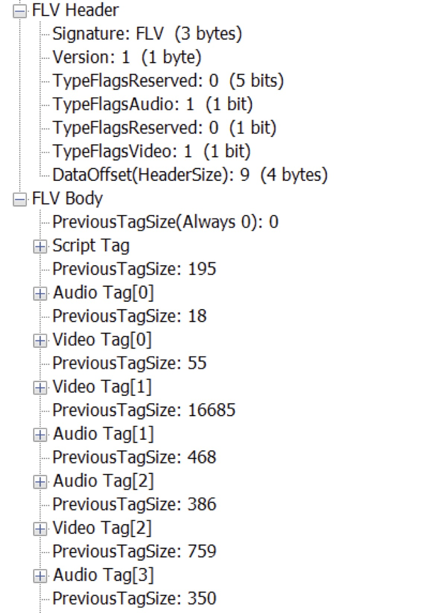
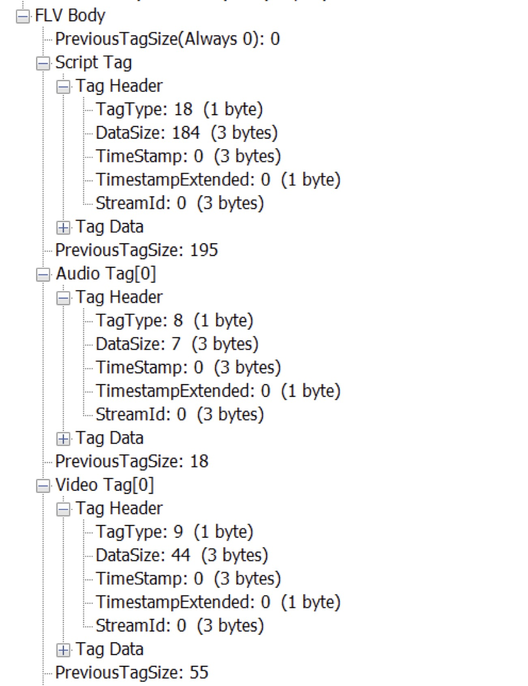
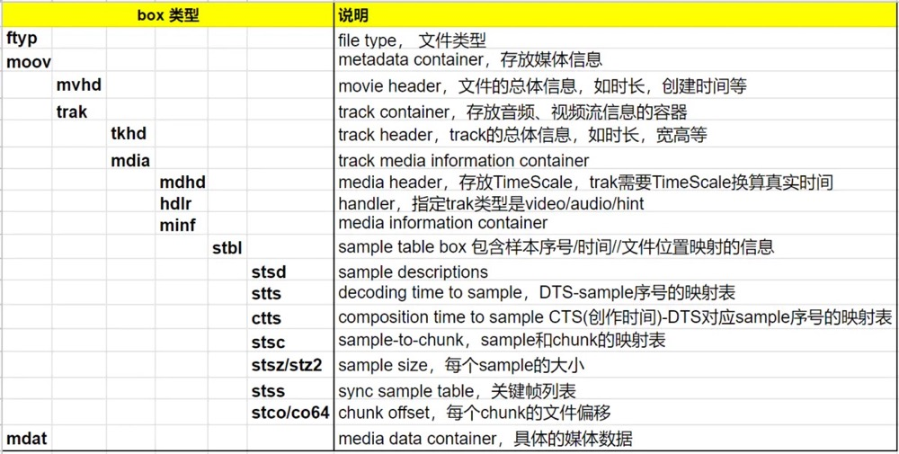
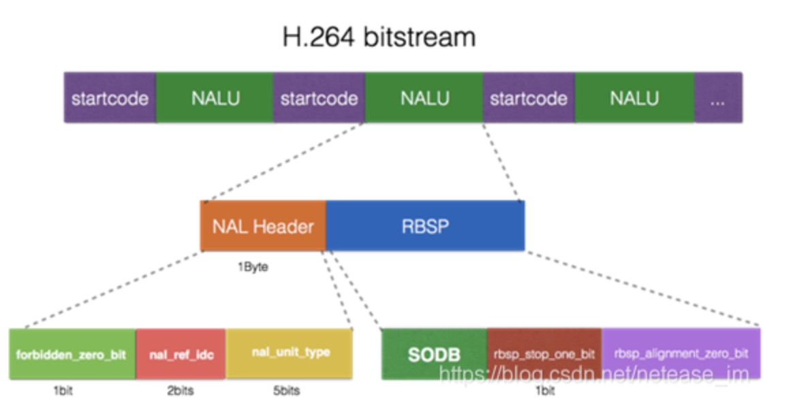
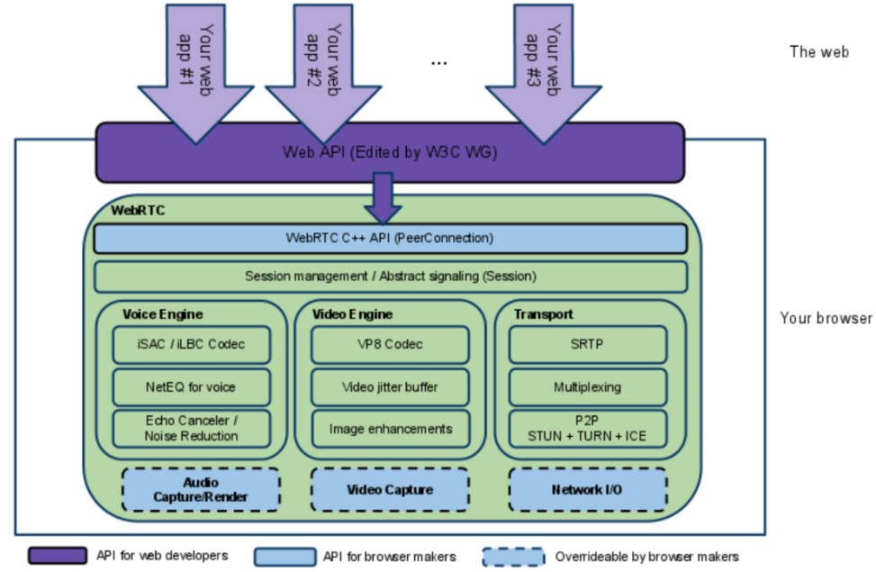
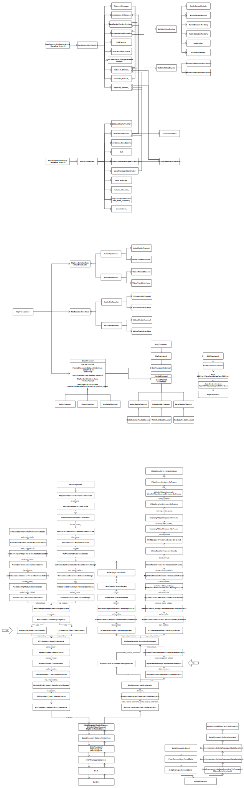

# Media Develop

## FLV

## 



## mp4

## 

## H264



## FFmpeg

### 编译

- 编译环境

  操作系统：Ubuntu Server 20.04 LTS 64bit

  ndk版本：ndk;22.0.7026061

  ffmpeg版本：5.0.1

  编译脚本

  ```sh
  #!/bin/bash
  
  #set config
  export BUILD_DIR=$PWD/build
  
  export ANDROID_SDK_ROOT=/usr/lib/android-sdk
  
  export ANDROID_NDK_ROOT=/usr/lib/android-sdk/ndk/22.0.7026061
  
  export TOOLCHAIN=$ANDROID_NDK_ROOT/toolchains/llvm/prebuilt/linux-x86_64
  
  export API_LEVEL=21
  
  export TARGET_BUILD_DIR=$PWD/build
  echo "build dir is $TARGET_BUILD_DIR "
  rm -rf $TARGET_BUILD_DIR
  mkdir -p $TARGET_BUILD_DIR
  
  for abi in armeabi-v7a arm64-v8a x86 x86-64
  
  do
  
  export ANDROID_ABI=$abi
  
  
  case $ANDROID_ABI in
  	armeabi-v7a)
  		#For 32-bit ARM, the compiler is prefixed with armv7a-linux-androideabi, but the binutils tools are prefixed with arm-linux-androideabi. For other architectures, the prefixes are the same for all tools.@see https://developer.android.com/ndk/guides/other_build_systems
  		export COMPILER_TARGET_PREFIX="armv7a-linux-androideabi"
  		export BINUTILS_TARGET_PREFIX="arm-linux-androideabi"
  		export ARCH_OPTIONS="	--disable-neon --enable-asm --enable-inline-asm "
  		export ARCH=arm
  		;;
  	arm64-v8a)
  		export COMPILER_TARGET_PREFIX="aarch64-linux-android"
                  export BINUTILS_TARGET_PREFIX="aarch64-linux-android"
  		export ARCH_OPTIONS=" 	--enable-neon --enable-asm --enable-inline-asm "
  		export ARCH=aarch64
  		;;
  	x86)
  		export COMPILER_TARGET_PREFIX="i686-linux-android"
                  export BINUTILS_TARGET_PREFIX="i686-linux-android"
  		export ARCH_OPTIONS=" 	--disable-neon --disable-asm --disable-inline-asm "
  		export ARCH=i686
  		;;
  	x86-64)
  		export COMPILER_TARGET_PREFIX="x86_64-linux-android"
                  export BINUTILS_TARGET_PREFIX="x86_64-linux-android"
  		export ARCH_OPTIONS="	--disable-neon --enable-asm --enable-inline-asm --x86asmexe=$TOOLCHAIN/bin/yasm"
  		export ARCH=x86_64
  		;;
  	*)
  		echo "$ANDROID_ABI fail"
  		exit 1
  		;;
  esac
  
  export TARGET_PREFIX_DIR=$TARGET_BUILD_DIR/$ANDROID_ABI
  echo "prefix dir is $TARGET_PREFIX_DIR "
  rm -rf $TARGET_PREFIX_DIR
  mkdir -p $TARGET_PREFIX_DIR
  
  
  export TARGET_AR=$TOOLCHAIN/bin/$BINUTILS_TARGET_PREFIX-ar
  export TARGET_AS=$TOOLCHAIN/bin/$BINUTILS_TARGET_PREFIX-as
  export TARGET_CC=$TOOLCHAIN/bin/$COMPILER_TARGET_PREFIX$API_LEVEL-clang
  export TARGET_CXX=$TOOLCHAIN/bin/$COMPILER_TARGET_PREFIX$API_LEVEL-clang++
  export TARGET_LD=$TOOLCHAIN/bin/$BINUTILS_TARGET_PREFIX-ld
  export TARGET_RANLIB=$TOOLCHAIN/bin/$BINUTILS_TARGET_PREFIX-ranlib
  export TARGET_STRIP=$TOOLCHAIN/bin/$BINUTILS_TARGET_PREFIX-strip
  export TARGET_NM=$TOOLCHAIN/bin/$BINUTILS_TARGET_PREFIX-nm
  
  make distclean
  
  ./configure \
   --prefix=${TARGET_PREFIX_DIR} \
   --enable-cross-compile \
   --target-os=android \
   --arch=${ARCH} \
   --sysroot=${TOOLCHAIN}/sysroot \
   --cc=${TARGET_CC} \
   --cxx=${TARGET_CXX} \
   --ld=${TARGET_CC}  \
   --ar=${TARGET_AR} \
   --as=${TARGET_CC} \
   --nm=${TARGET_NM} \
   --ranlib=${TARGET_RANLIB} \
   --strip=${TARGET_STRIP} \
   --extra-cflags="-O3 -fPIC -I${PWD}/build/external/${ANDROID_ABI}/include" \
   --extra-ldflags="-L${PWD}/build/external/${ANDROID_ABI}/lib " \
   --pkg-config=/usr/bin/pkg-config \
   --enable-shared --disable-static \
   --disable-doc \
   --disable-programs \
   --enable-small \
   --disable-debug \
   ${ARCH_OPTIONS} || exit 1
  # --x86asmexe=${TOOLCHAIN}/bin/yasm \
  
  make || exit 1
  make install || exit 1
  
  done
  ```
  

​		https支持：

​		单独下载编译openssl库，并将openssl库下不同架构的库目		录配置到ffmpeg的编译环境cflags及ldflags中		

### libavformat

### libavcodec

### libswresample

### libavutil

## WebRtc





### WebSocket

- https://github.com/thinkerzhangyan/androidWebsocketDemo

## 直播

## 播放器

## 短视频

## 视频通话

## 疑难问题

### 绿屏/黑屏

1. 颜色格式编码器不支持
2. 部分手机硬编码器的编码数据与ios硬解码器不兼容
3. 部分编码器参数设置与ios硬解码不兼容
4. 宽高参数随意设置导致绿条
5. 渲染脏数据

### 卡顿

1. 编码时间戳错误，改为正确时间戳
2. 采集帧率慢，优化采集效率
3. 渲染帧率慢，优化渲染效率
4. 编码效率慢，优化编码器逻辑
5. 网络差，及时反馈到UI层提示主播调整网络
6. 手机运行慢，优化耗费资源的任务

### 模糊/马赛克/花屏

1. 分辨率过大
2. 码率低
3. 拍摄环境光线较差
4. 错误丢失帧数据
5. 采集图像分辨率低于编码分辨率

### 杂音/回声

1. 录音环境较差
2. 音频处理出现错误
3. 重采样导致音频质量下降
4. 部分设备不支持communication录音模式
5. 音频编码参数错误

### 声画不同步

1. 音视频编码时间戳不一致
2. 图像或音频处理时间差较大
3. 音视频帧封装时间戳不一致
4. audio缺少config帧或vidio缺少sps/pps帧
5. 录制音视频流切换后关键帧缺少sps/pps数据6、音视频设备或编码器初始化失败