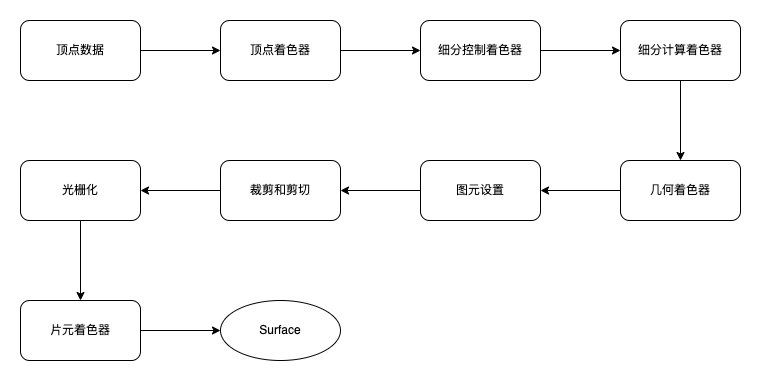

# GLSL技术实践


### load shader
```
int shader = GLES20.glCreateShader(shaderType);
checkGlError("glCreateShader type=" + shaderType);
GLES20.glShaderSource(shader, source);
GLES20.glCompileShader(shader);
int[] compiled = new int[1];
GLES20.glGetShaderiv(shader, GLES20.GL_COMPILE_STATUS, compiled, 0);
if (compiled[0] == 0) {
    Log.e(TAG, "Could not compile shader " + shaderType + ":");
    Log.e(TAG, " " + GLES20.glGetShaderInfoLog(shader));
    GLES20.glDeleteShader(shader);
    shader = 0;
}
```

### vertex shader
```
uniform mat4 uMVPMatrix;
uniform mat4 uTexMatrix;
attribute vec4 aPosition;
attribute vec4 aTextureCoord;
varying vec2 vTextureCoord;
void main() {
    gl_Position = uMVPMatrix * aPosition;
    vTextureCoord = (uTexMatrix * aTextureCoord).xy;
}
```

### fragment shader
```
precision mediump float;
varying vec2 vTextureCoord;
uniform sampler2D sTexture;
void main() {
    gl_FragColor = texture2D(sTexture, vTextureCoord);
}
```

### uniform&attribute
```
maPositionLoc = GLES20.glGetAttribLocation(mProgramHandle, "aPosition");
GlUtil.checkLocation(maPositionLoc, "aPosition");
maTextureCoordLoc = GLES20.glGetAttribLocation(mProgramHandle, "aTextureCoord");
GlUtil.checkLocation(maTextureCoordLoc, "aTextureCoord");
muMVPMatrixLoc = GLES20.glGetUniformLocation(mProgramHandle, "uMVPMatrix");
GlUtil.checkLocation(muMVPMatrixLoc, "uMVPMatrix");
muTexMatrixLoc = GLES20.glGetUniformLocation(mProgramHandle, "uTexMatrix");
GlUtil.checkLocation(muTexMatrixLoc, "uTexMatrix");
```

### GLSL变量类型

| 变量类型                  | 类型描述                         |
|---------------------------|----------------------------------|
| float, int, bool              | 浮点型，整型，布尔型的标量数据类型 |
| float, vec2, vec3, vec4       | 包含1，2，3，4个元素的浮点型向量    |
| int, ivec2, ivec3, ivec4      | 包含1，2，3，4个元素的整型向量      |
| bool, bvec2, bvec3, bvec4     | 包含1，2，3，4个元素的布尔型向量    |
| mat2, mat3, mat4              | 尺寸为2x2，3x3，4x4的浮点型矩阵    |
| sampler2D, samplerCube, ……    | 表示2D，立方体纹理的句柄          |

### GLSL限定符

| 限定符    | 符号描述                                                                       |
|-----------|--------------------------------------------------------------------------------|
| attribute | 由应用程序传输给顶点着色器的逐顶点的数据                                       |
| uniform   | 在图元处理过程中其值保持不变，由应用程序传输给着色器                            |
| varying   | 由顶点着色器传输给片段着色器中的插值数据                                       |
| const     | 编译时常量，或只读的函数参数                                                    |
| highp     | 满足顶点着色语言的最低要求。对片段着色语言是可选项                              |
| mediump   | 满足片段着色语言的最低要求，其对于范围和精度的要求必须不低于lowp并且不高于highp |
| lowp      | 范围和精度可低于mediump，但仍可以表示所有颜色通道的所有颜色值                   |

### GLSL内置变量
gl_Position、gl_FragColor

### GLSL内置函数
通用函数、三角函数、指数函数、几何函数、矩阵函数、向量函数、纹理函数

### GLSL工具
kodelife、AS GLSL support plugin

### 参考
https://www.khronos.org/opengl/wiki/Data_Type_(GLSL)
https://www.khronos.org/opengl/wiki/Built-in_Variable_(GLSL)
http://ptgmedia.pearsoncmg.com/images/9780321552624/downloads/0321552628_AppI.pdf
https://colin1994.github.io/2017/11/11/OpenGLES-Lesson04/
https://colin1994.github.io/2017/11/12/OpenGLES-Lesson05/