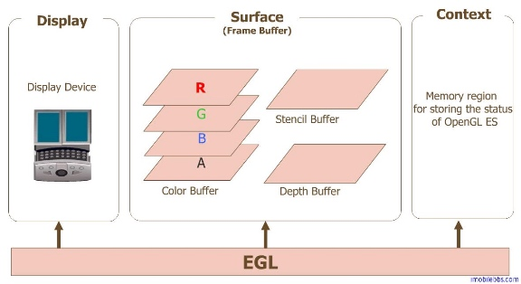
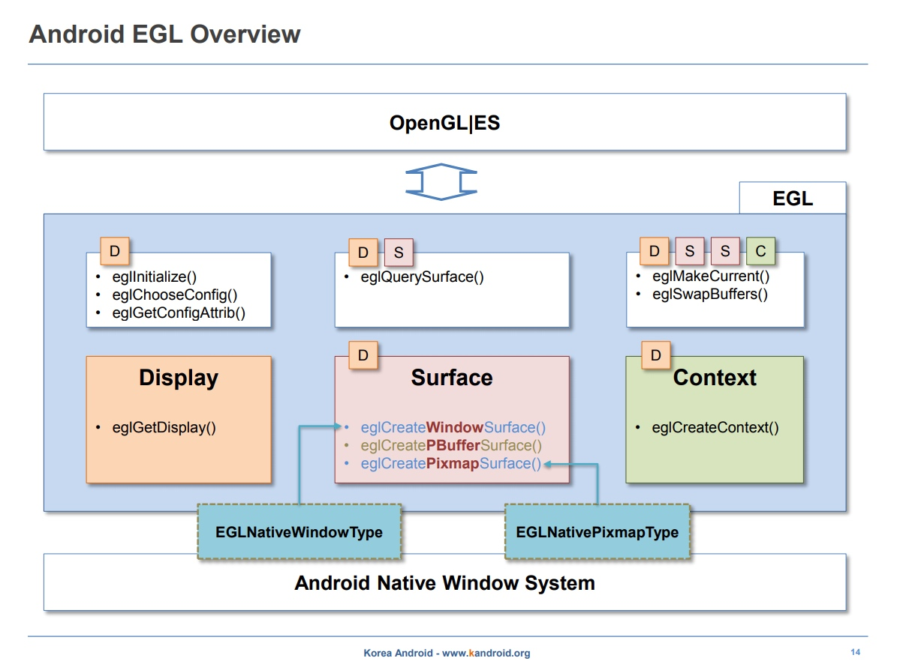
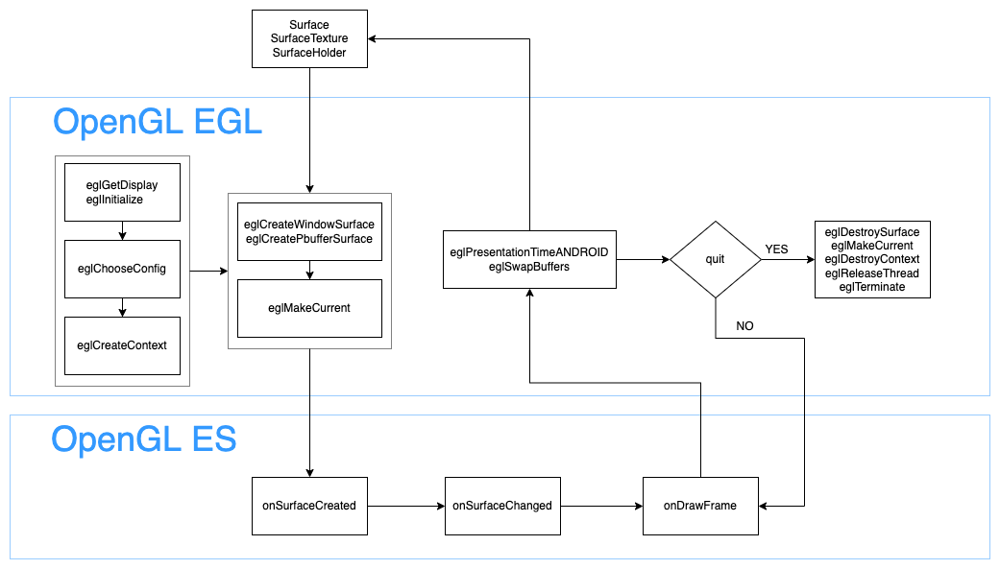

# 安卓OpenGL EGL技术实践

OpenGL EGL 是 OpenGL ES 渲染 API 和本地窗口系统（native platform window system）之间的一个中间接口层。


    

为了让 OpenGL ES 能够绘制在当前设备上，我们需要 EGL 作为 OpenGL ES 与设备的桥梁。



Android 为 OpenGL 的绘制提供了一个特定的视图GLSurfaceView,通过setRenderer方法给它设置一个渲染器.GLSurfaceView.Renderer 类可控制在与之相关联的 GLSurfaceView 上绘制的内容。Android 系统会调用渲染程序中的以下三种方法来确定在 GLSurfaceView 上绘制什么内容以及如何绘制：

* onSurfaceCreated() - 调用一次以设置视图的 OpenGL ES 环境。
* onDrawFrame() - 每次重新绘制视图时调用。
* onSurfaceChanged() - 当视图的几何图形发生变化（例如当设备的屏幕方向发生变化）时调用。
```
import javax.microedition.khronos.egl.EGLConfig;
import javax.microedition.khronos.opengles.GL10;

import android.opengl.GLES20;
import android.opengl.GLSurfaceView;

public class MyGLRenderer implements GLSurfaceView.Renderer {

    public void onSurfaceCreated(GL10 unused, EGLConfig config) {
        // Set the background frame color
        GLES20.glClearColor(0.0f, 0.0f, 0.0f, 1.0f);
    }

    public void onDrawFrame(GL10 unused) {
        // Redraw background color
        GLES20.glClear(GLES20.GL_COLOR_BUFFER_BIT);
    }

    public void onSurfaceChanged(GL10 unused, int width, int height) {
        GLES20.glViewport(0, 0, width, height);
    }
}
    
```

我们也可以封装自己的 EGL 环境。




### 创建EGLDisplay
EGLDisplay是对实际显示设备的抽象

```        
// Return an EGLDisplay, or die trying.
private static EGLDisplay getEglDisplay() {
    EGLDisplay eglDisplay = EGL14.eglGetDisplay(EGL14.EGL_DEFAULT_DISPLAY);
    if (eglDisplay == EGL14.EGL_NO_DISPLAY) {
        throw new RuntimeException(
                "Unable to get EGL14 display: 0x" + Integer.toHexString(EGL14.eglGetError()));
    }
    int[] version = new int[2];
    if (!EGL14.eglInitialize(eglDisplay, version, 0, version, 1)) {
        throw new RuntimeException(
                "Unable to initialize EGL14: 0x" + Integer.toHexString(EGL14.eglGetError()));
    }
    return eglDisplay;
}
```

### 配置EGLConfig

```
public static final int[] CONFIG_PLAIN = {
        EGL10.EGL_RED_SIZE, 8,
        EGL10.EGL_GREEN_SIZE, 8,
        EGL10.EGL_BLUE_SIZE, 8,
        EGL10.EGL_RENDERABLE_TYPE, EGL_OPENGL_ES2_BIT,
        EGL10.EGL_NONE
};
    
// Return an EGLConfig, or die trying.
private static EGLConfig getEglConfig(EGLDisplay eglDisplay, int[] configAttributes) {
    EGLConfig[] configs = new EGLConfig[1];
    int[] numConfigs = new int[1];
    if (!EGL14.eglChooseConfig(
            eglDisplay, configAttributes, 0, configs, 0, configs.length, numConfigs, 0)) {
        throw new RuntimeException(
                "eglChooseConfig failed: 0x" + Integer.toHexString(EGL14.eglGetError()));
    }
    if (numConfigs[0] <= 0) {
        throw new RuntimeException("Unable to find any matching EGL config");
    }
    final EGLConfig eglConfig = configs[0];
    if (eglConfig == null) {
        throw new RuntimeException("eglChooseConfig returned null");
    }
    return eglConfig;
}
```

### 创建EGLContext
EGLContext存储OpenGL ES绘图的一些状态信息

```
// Return an EGLContext, or die trying.
private static EGLContext createEglContext(
        Context sharedContext, EGLDisplay eglDisplay, EGLConfig eglConfig) {
    if (sharedContext != null && sharedContext.egl14Context == EGL14.EGL_NO_CONTEXT) {
        throw new RuntimeException("Invalid sharedContext");
    }
    int[] contextAttributes = {EGL14.EGL_CONTEXT_CLIENT_VERSION, 2, EGL14.EGL_NONE};
    EGLContext rootContext =
            sharedContext == null ? EGL14.EGL_NO_CONTEXT : sharedContext.egl14Context;
    final EGLContext eglContext;
    synchronized (lock) {
        eglContext = EGL14.eglCreateContext(eglDisplay, eglConfig, rootContext, contextAttributes, 0);
    }
    if (eglContext == EGL14.EGL_NO_CONTEXT) {
        throw new RuntimeException(
                "Failed to create EGL context: 0x" + Integer.toHexString(EGL14.eglGetError()));
    }
    return eglContext;
}
```

### 创建EGLSurface
EGLSurface用来存储图像的内存区域
1. eglCreateWindowSurface：创建渲染到屏幕的渲染表面

```
// Create EGLSurface from either Surface or SurfaceTexture.
private void createSurfaceInternal(Object surface) {
    if (!(surface instanceof Surface) && !(surface instanceof SurfaceTexture)) {
        throw new IllegalStateException("Input must be either a Surface or SurfaceTexture");
    }
    checkIsNotReleased();
    if (eglSurface != EGL14.EGL_NO_SURFACE) {
        throw new RuntimeException("Already has an EGLSurface");
    }
    int[] surfaceAttribs = {EGL14.EGL_NONE};
    eglSurface = EGL14.eglCreateWindowSurface(eglDisplay, eglConfig, surface, surfaceAttribs, 0);
    if (eglSurface == EGL14.EGL_NO_SURFACE) {
        throw new RuntimeException(
                "Failed to create window surface: 0x" + Integer.toHexString(EGL14.eglGetError()));
    }
}
```

2. eglCreatePbufferSurface：创建离屏的渲染表面

```
public void createPbufferSurface(int width, int height) {
    checkIsNotReleased();
    if (eglSurface != EGL14.EGL_NO_SURFACE) {
        throw new RuntimeException("Already has an EGLSurface");
    }
    int[] surfaceAttribs = {EGL14.EGL_WIDTH, width, EGL14.EGL_HEIGHT, height, EGL14.EGL_NONE};
    eglSurface = EGL14.eglCreatePbufferSurface(eglDisplay, eglConfig, surfaceAttribs, 0);
    if (eglSurface == EGL14.EGL_NO_SURFACE) {
        throw new RuntimeException("Failed to create pixel buffer surface with size " + width + "x"
                + height + ": 0x" + Integer.toHexString(EGL14.eglGetError()));
    }
}
```
    
### 绑定EGLSurface

```
public void makeCurrent() {
    checkIsNotReleased();
    if (eglSurface == EGL14.EGL_NO_SURFACE) {
        throw new RuntimeException("No EGLSurface - can't make current");
    }
    synchronized (lock) {
        if (!EGL14.eglMakeCurrent(eglDisplay, eglSurface, eglSurface, eglContext)) {
            throw new RuntimeException(
                    "eglMakeCurrent failed: 0x" + Integer.toHexString(EGL14.eglGetError()));
        }
    }
}
```

### 交换缓冲，进行显示

```
public void swapBuffers(long timeStampNs) {
    checkIsNotReleased();
    if (eglSurface == EGL14.EGL_NO_SURFACE) {
        throw new RuntimeException("No EGLSurface - can't swap buffers");
    }
    synchronized (lock) {
        // See https://android.googlesource.com/platform/frameworks/native/+/tools_r22.2/opengl/specs/EGL_ANDROID_presentation_time.txt
        EGLExt.eglPresentationTimeANDROID(eglDisplay, eglSurface, timeStampNs);
        EGL14.eglSwapBuffers(eglDisplay, eglSurface);
    }
}
```

### 释放资源

```
public void releaseSurface() {
    if (eglSurface != EGL14.EGL_NO_SURFACE) {
        EGL14.eglDestroySurface(eglDisplay, eglSurface);
        eglSurface = EGL14.EGL_NO_SURFACE;
    }
}
    
public void detachCurrent() {
    synchronized (lock) {
        if (!EGL14.eglMakeCurrent(
                eglDisplay, EGL14.EGL_NO_SURFACE, EGL14.EGL_NO_SURFACE, EGL14.EGL_NO_CONTEXT)) {
            throw new RuntimeException(
                    "eglDetachCurrent failed: 0x" + Integer.toHexString(EGL14.eglGetError()));
        }
    }
}
    
public void release() {
    checkIsNotReleased();
    releaseSurface();
    detachCurrent();
    EGL14.eglDestroyContext(eglDisplay, eglContext);
    EGL14.eglReleaseThread();
    EGL14.eglTerminate(eglDisplay);
    eglContext = EGL14.EGL_NO_CONTEXT;
    eglDisplay = EGL14.EGL_NO_DISPLAY;
    eglConfig = null;
}
```
    
### 参考
* https://www.khronos.org/egl
* https://www.khronos.org/registry/EGL/sdk/docs/man/
* https://www.khronos.org/files/egl-1-4-quick-reference-card.pdf

